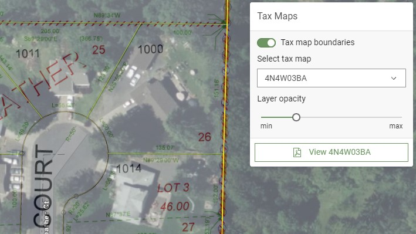

# vernonia-tax-maps

## About

A tool for downloading Columbia County tax maps within and adjacent to Vernonia City Limits.

Files are included as JPEGs and PDFs. JPEGs are georeferenced via the accompanying `*.aux.xml` file in spatial reference NAD 1983 (2011) Oregon Statewide Lambert (Intl Feet) _WKID 6557_.

Georeferenced tax maps can be viewed overlaid with imagery and and other layers in [Vernonia Map](https://map.vernonia-or.gov/) using the Tax Maps widget or with [Tax Map Viewer](https://vernonia-tax-map-viewer.netlify.app/).

## Files

### Boundaries

[TaxMapBoundaries.geojson](/TaxMapBoundaries.geojson)

### PDFs and JPEGs

| Tax Map | PDF | JPEG | Georeference | Last Updated |
| --- | :---: | :---: | :---: | :---: |
| 4403 | [4403.pdf](/tax-maps/pdf/4403.pdf) | [4403.jpg](/tax-maps/jpg/4403.jpg) | [4403.jpg.aux.xml](/tax-maps/jpg/4403.jpg.aux.xml) | 2023.06.05 |
| 4403BA | [4403BA.pdf](/tax-maps/pdf/4403BA.pdf) | [4403BA.jpg](/tax-maps/jpg/4403BA.jpg) | [4403BA.jpg.aux.xml](/tax-maps/jpg/4403BA.jpg.aux.xml) | 2023.05.03 |
| 4403BB | [4403BB.pdf](/tax-maps/pdf/4403BB.pdf) | [4403BB.jpg](/tax-maps/jpg/4403BB.jpg) | [4403BB.jpg.aux.xml](/tax-maps/jpg/4403BB.jpg.aux.xml) | 2023.09.08 |
| 4403BC | [4403BC.pdf](/tax-maps/pdf/4403BC.pdf) | [4403BC.jpg](/tax-maps/jpg/4403BC.jpg) | [4403BC.jpg.aux.xml](/tax-maps/jpg/4403BC.jpg.aux.xml) | 2023.09.08 |
| 4403BD | [4403BD.pdf](/tax-maps/pdf/4403BD.pdf) | [4403BD.jpg](/tax-maps/jpg/4403BD.jpg) | [4403BD.jpg.aux.xml](/tax-maps/jpg/4403BD.jpg.aux.xml) | n/a |
| 4403CA | [4403CA.pdf](/tax-maps/pdf/4403CA.pdf) | [4403CA.jpg](/tax-maps/jpg/4403CA.jpg) | [4403CA.jpg.aux.xml](/tax-maps/jpg/4403CA.jpg.aux.xml) | n/a |
| 4404| [4404.pdf](/tax-maps/pdf/4404.pdf) | [4404.jpg](/tax-maps/jpg/4404.jpg) | [4404.jpg.aux.xml](/tax-maps/jpg/4404.jpg.aux.xml) | 2023.06.05 |
| 4404AB | [4404AB.pdf](/tax-maps/pdf/4404AB.pdf) | [4404AB.jpg](/tax-maps/jpg/4404AB.jpg) | [4404AB.jpg.aux.xml](/tax-maps/jpg/4404AB.jpg.aux.xml) | n/a |
| 4404AC | [4404AC.pdf](/tax-maps/pdf/4404AC.pdf) | [4404AC.jpg](/tax-maps/jpg/4404AC.jpg) | [4404AC.jpg.aux.xml](/tax-maps/jpg/4404AC.jpg.aux.xml) | n/a |
| 4404AD | [4404AD.pdf](/tax-maps/pdf/4404AD.pdf) | [4404AD.jpg](/tax-maps/jpg/4404AD.jpg) | [4404AD.jpg.aux.xml](/tax-maps/jpg/4404AD.jpg.aux.xml) | n/a |
| 4404BA | [4404BA.pdf](/tax-maps/pdf/4404BA.pdf) | [4404BA.jpg](/tax-maps/jpg/4404BA.jpg) | [4404BA.jpg.aux.xml](/tax-maps/jpg/4404BA.jpg.aux.xml) | n/a |
| 4404BB | [4404BB.pdf](/tax-maps/pdf/4404BB.pdf) | [4404BB.jpg](/tax-maps/jpg/4404BB.jpg) | [4404BB.jpg.aux.xml](/tax-maps/jpg/4404BB.jpg.aux.xml) | 2023.07.28 |
| 4404BC | [4404BC.pdf](/tax-maps/pdf/4404BC.pdf) | [4404BC.jpg](/tax-maps/jpg/4404BC.jpg) | [4404BC.jpg.aux.xml](/tax-maps/jpg/4404BC.jpg.aux.xml) | n/a |
| 4404BD | [4404BD.pdf](/tax-maps/pdf/4404BD.pdf) | [4404BD.jpg](/tax-maps/jpg/4404BD.jpg) | [4404BD.jpg.aux.xml](/tax-maps/jpg/4404BD.jpg.aux.xml) | n/a |
| 4404CA | [4404CA.pdf](/tax-maps/pdf/4404CA.pdf) | [4404CA.jpg](/tax-maps/jpg/4404CA.jpg) | [4404CA.jpg.aux.xml](/tax-maps/jpg/4404CA.jpg.aux.xml) | n/a |
| 4404CB | [4404CB.pdf](/tax-maps/pdf/4404CB.pdf) | [4404CB.jpg](/tax-maps/jpg/4404CB.jpg) | [4404CB.jpg.aux.xml](/tax-maps/jpg/4404CB.jpg.aux.xml) | n/a |
| 4404DA | [4404DA.pdf](/tax-maps/pdf/4404DA.pdf) | [4404DA.jpg](/tax-maps/jpg/4404DA.jpg) | [4404DA.jpg.aux.xml](/tax-maps/jpg/4404DA.jpg.aux.xml) | n/a |
| 4405 | [4405.pdf](/tax-maps/pdf/4405.pdf) | [4405.jpg](/tax-maps/jpg/4405.jpg) | [4405.jpg.aux.xml](/tax-maps/jpg/4405.jpg.aux.xml) | n/a |
| 4405AA | [4405AA.pdf](/tax-maps/pdf/4405AA.pdf) | [4405AA.jpg](/tax-maps/jpg/4405AA.jpg) | [4405AA.jpg.aux.xml](/tax-maps/jpg/4405AA.jpg.aux.xml) | n/a |
| 4405AC | [4405AC.pdf](/tax-maps/pdf/4405AC.pdf) | [4405AC.jpg](/tax-maps/jpg/4405AC.jpg) | [4405AC.jpg.aux.xml](/tax-maps/jpg/4405AC.jpg.aux.xml) | n/a |
| 4405AD | [4405AD.pdf](/tax-maps/pdf/4405AD.pdf) | [4405AD.jpg](/tax-maps/jpg/4405AD.jpg) | [4405AD.jpg.aux.xml](/tax-maps/jpg/4405AD.jpg.aux.xml) | n/a |
| 4405DA | [4405DA.pdf](/tax-maps/pdf/4405DA.pdf) | [4405DA.jpg](/tax-maps/jpg/4405DA.jpg) | [4405DA.jpg.aux.xml](/tax-maps/jpg/4405DA.jpg.aux.xml) | n/a |
| 4405DD | [4405DD.pdf](/tax-maps/pdf/4405DD.pdf) | [4405DD.jpg](/tax-maps/jpg/4405DD.jpg) | [4405DD.jpg.aux.xml](/tax-maps/jpg/4405DD.jpg.aux.xml) | n/a |
| 4406 | [4406.pdf](/tax-maps/pdf/4406.pdf) | [4406.jpg](/tax-maps/jpg/4406.jpg) | [4406.jpg.aux.xml](/tax-maps/jpg/4406.jpg.aux.xml) | 2023.05.05 |
| 4407 | [4407.pdf](/tax-maps/pdf/4407.pdf) | [4407.jpg](/tax-maps/jpg/4407.jpg) | [4407.jpg.aux.xml](/tax-maps/jpg/4407.jpg.aux.xml) | 2023.05.05 |
| 4408 | [4408.pdf](/tax-maps/pdf/4408.pdf) | [4408.jpg](/tax-maps/jpg/4408.jpg) | [4408.jpg.aux.xml](/tax-maps/jpg/4408.jpg.aux.xml) | 2023.05.05 |
| 4501 | [4501.pdf](/tax-maps/pdf/4501.pdf) | [4501.jpg](/tax-maps/jpg/4501.jpg) | [4501.jpg.aux.xml](/tax-maps/jpg/4501.jpg.aux.xml) | 2023.05.05 |
| 4512 | [4512.pdf](/tax-maps/pdf/4512.pdf) | [4512.jpg](/tax-maps/jpg/4512.jpg) | [4512.jpg.aux.xml](/tax-maps/jpg/4512.jpg.aux.xml) | 2023.05.05 |
| 5432 | [5432.pdf](/tax-maps/pdf/5432.pdf) | [5432.jpg](/tax-maps/jpg/5432.jpg) | [5432.jpg.aux.xml](/tax-maps/jpg/5432.jpg.aux.xml) | n/a |
| 5433 | [5433.pdf](/tax-maps/pdf/5433.pdf) | [5433.jpg](/tax-maps/jpg/5433.jpg) | [5433.jpg.aux.xml](/tax-maps/jpg/5433.jpg.aux.xml) | n/a |
| 5433CD | [5433CD.pdf](/tax-maps/pdf/5433CD.pdf) | [5433CD.jpg](/tax-maps/jpg/5433CD.jpg) | [5433CD.jpg.aux.xml](/tax-maps/jpg/5433CD.jpg.aux.xml) | n/a |
| 5433DC | [5433DC.pdf](/tax-maps/pdf/5433DC.pdf) | [5433DC.jpg](/tax-maps/jpg/5433DC.jpg) | [5433DC.jpg.aux.xml](/tax-maps/jpg/5433DC.jpg.aux.xml) | n/a |
| 5434 | [5434.pdf](/tax-maps/pdf/5434.pdf) | [5434.jpg](/tax-maps/jpg/5434.jpg) | [5434.jpg.aux.xml](/tax-maps/jpg/5434.jpg.aux.xml) | n/a |
| 5434CC | [5434CC.pdf](/tax-maps/pdf/5434CC.pdf) | [5434CC.jpg](/tax-maps/jpg/5434CC.jpg) | [5434CC.jpg.aux.xml](/tax-maps/jpg/5434CC.jpg.aux.xml) | n/a |
| 5434CD | [5434CD.pdf](/tax-maps/pdf/5434CD.pdf) | [5434CD.jpg](/tax-maps/jpg/5434CD.jpg) | [5434CD.jpg.aux.xml](/tax-maps/jpg/5434CD.jpg.aux.xml) | n/a |

## Run the Tool

### Install

1. Clone this repository.
1. Run `npm install` to install dependencies.
1. Run `node index.js` to download and process tax map files.

Prerequisite: [GhostScript](https://ghostscript.com/download.html) installed with `gswin64c` available to execute via command line.

### Use in ArcGIS Pro

Copy or add `tax-maps/jpg` directory to a Pro project and add images to a map.

### Updates and Versioning

Updates are generally performed Monday morning (if I remember) and only if any tax map has been updated. Versioning is Year-Month-Day, i.e. `v2021.02.03`.

***

Made with :heart: and :coffee: in Vernonia, Oregon
